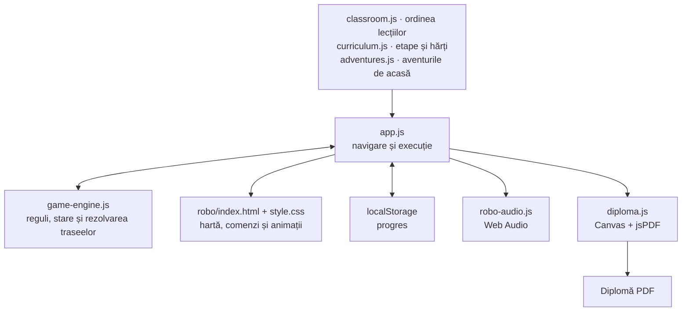

# Școala altfel · ScratchJr și Robo

Cursul ScratchJr și jocurile Robo Explorator, în limba română, pentru clasa pregătitoare.

În Robo, copiii aleg săgeți și acțiuni ca să conducă un roboțel spre o căsuță sau o comoară. Ideea este să încerce, să observe ce se întâmplă și să repare împreună drumul.

[Meniul principal](https://scoalaaltfelexploratori.github.io/Pregatitoare1/) · [Cele 10 lecții ScratchJr](https://scoalaaltfelexploratori.github.io/Pregatitoare1/scratchjr/) · [Exercițiile originale Robo](https://scoalaaltfelexploratori.github.io/Pregatitoare1/robo/) · [Acasă cu Robo](https://scoalaaltfelexploratori.github.io/Pregatitoare1/robo/?adventure=home)

## Meniul siteului

- [Lecția 0 · Laboratorul surprizelor](scratchjr/lectia-0/index.html) este prezentarea interactivă pentru laptop și proiector: zece idei, adunări și scăderi 0–10, provocare dificilă, două rezerve. Copiii răspund cu voce tare și vin uneori la laptop. [Ghidul profesorului pentru cele 50 de minute](scratchjr/lectia-0/README.md).

- `index.html` este intrarea comună, cu două secțiuni separate.
- [ScratchJr](scratchjr/index.html) listează toate cele zece lecții. Fiecare are legături la ghid, cartonașe și pachetul ZIP. Paginile lecțiilor au Înapoi/Înainte și întoarcere la meniu.
- [Robo](robo/index.html) păstrează jocul original, cele 22 de activități pentru clasă și aventura de acasă. Fișele pentru acasă sunt în continuare în antetul jocului.
- Linkurile vechi cu `?lesson=8&variant=2`, `?adventure=home` sau `#joaca` continuă să deschidă Robo. Pagina fără parametri arată meniul. Progresul Robo folosește aceleași chei în același browser.

Nu este un al doilea site sau un alt repository. Toate legăturile sunt relative și funcționează inclusiv sub folderul `/Pregatitoare1/` al GitHub Pages. Pentru utilizarea offline păstrează întregul proiect și deschide `index.html`. ScratchJr se folosește în aplicația instalată; siteul oferă cerințele și materialele profesorului.

[Raportul verificării meniului și legăturilor](verificare_site/README.md).


## Cum folosim Robo

- **La clasă:** proiectăm jocul pe tabla digitală, iar copiii vin pe rând la laptop. Un copil propune câțiva pași, ceilalți spun unde cred că va ajunge Robo, apoi testăm.
- **Acasă:** șase misiuni de făcut împreună cu un părinte. După terminarea lor se poate descărca o diplomă PDF, cu prenumele copilului sau cu spațiul lăsat liber.
- **Fără internet:** descarcă și dezarhivează proiectul, apoi deschide `index.html` într-un browser modern. Păstrează folderul `assets/` alături de fișierele jocului.

Nu sunt necesare conturi. Nu există note, cronometru sau limită de încercări.

## Fișă de lucru pentru acasă

- [Fișa de tipărit, PDF](materiale/Robo_Acasa_Harta_7x7.pdf): o hartă 7×7 pe o pagină A4, cu trei drumuri spre căsuță. Drumul mai lung trece pe la stația de încărcare din E3. Robo are energie pentru 8 pași, apoi trebuie să încarce pentru a ajunge acasă. Copilul completează cele 18 căsuțe cu săgeți, încărcarea bateriei și activarea podului.
- [Soluția pentru părinte, PDF](materiale/Robo_Acasa_Harta_7x7_sol.pdf): traseul marcat, programul complet și explicația consumului de energie.

## Lecțiile Robo

Cele 22 de lecții sunt disponibile direct în selectorul de sus. Unele au mai multe variante de hartă. Putem alege cât lucrăm în funcție de ritmul copiilor:

- **1–2:** primii pași, apoi „Încercăm și reparăm”: Robo se oprește la margine, ștergem săgeata blocată și continuăm cu alta.
- **3:** anticiparea destinației, începând cu ↑ ↑ →. Alte runde păstrează modelul: doi pași în aceeași direcție, apoi o schimbare.
- **4–5:** un drum de patru pași până la căsuța din dreapta sus, apoi ocolirea copacilor.
- **6–8:** trasee 5×5 cu toate direcțiile, cheia pentru comoară și activarea podului.
- **9:** compararea a două drumuri.
- **10–12:** udarea florilor și descoperirea pașilor care se repetă.
- **13–14:** „Udă un rând”, o secvență cu nume, refolosită în grădina cu rândurile A, B și C.
- **15:** „Dacă este o floare” — Robo verifică locul înainte să ude.
- **16:** o hartă 4×4 cu căsuța în dreapta sus. Sunt mai multe drumuri, dar bateria ajunge doar pe traseul care trece la timp prin singura stație de încărcare.
- **17–19:** trei hărți 5×5: un ocol după cheie, o manetă pe malul râului și trei flori care deschid poarta.
- **20–22:** trei hărți 7×7: alegerea stațiilor de încărcare, vizitarea a trei stele și o călătorie care combină podul cu bateria. Putem construi programele în bucăți, schimbând copilul la fiecare oprire.

Câteva controale utile în timpul activității:

- **Pornește Robo** continuă din poziția curentă, cu comenzile noi. Putem construi drumul în bucăți, chiar cu mai mulți copii.
- **La start** reia harta și păstrează programul. **Alt copil** pregătește aceeași hartă cu programul gol; în lecția de reparare, readuce exemplul → ↓.
- **Pentru adult** conține sunetul, ecranul complet, ajutorul pentru traseu și întrebări pentru discuția cu clasa.

Linkul secțiunii Robo începe cu lecția 1. Pentru o anumită lecție se poate folosi, de exemplu, `?lesson=8`; `&variant=2` alege a doua variantă. La reîncărcarea paginii se păstrează alegerea lecției din adresă, iar încercarea pornește de la început.

## Cum este construit

- **HTML, CSS și JavaScript simplu**, fără framework, server de aplicație sau pas de build. Fișierele sunt servite ca atare de GitHub Pages.
- **Hărți definite în cod:** grile de 3×3, 4×4, 5×5 și 7×7, cu poziții `[x, y]` numărate de la zero, obstacole și obiecte precum cheia, maneta, florile sau stațiile de încărcare.
- **Motor separat de interfață:** `game-engine.js` validează comenzile și calculează starea următoare. Funcția `solve()` caută în lățime (BFS) un drum valid, ținând cont și de cheie, pod, flori și energie.
- **Program reprezentat ca date:** săgețile sunt comenzi precum `'R'` și `'U'`; repetițiile au forma `{ repeat: 2, commands: ['R', 'W'] }`, iar rețeta se apelează cu `{ call: 'water-row' }`. Motorul le desfășoară în pași simpli.
- **Execuție pas cu pas:** `app.js` păstrează poziția, obiectele și numărul comenzilor executate. Oprirea sau schimbarea lecției anulează rularea în așteptare, ca să nu execute din nou un pas deja făcut.
- **Grafică și sunet locale:** interfața folosește DOM, CSS și SVG, iar efectele sonore sunt generate cu Web Audio API. Sunetul pornește numai la cererea adultului.
- **Diplomă în browser:** `diploma.js` desenează ilustrația, numele și data pe un canvas, apoi folosește copia locală de jsPDF pentru un PDF A4 pe orizontală. Textul din PDF face parte din imagine.

### Organizarea codului


```mermaid
flowchart TD
    Lessons["classroom.js · ordinea lecțiilor<br/>curriculum.js · etape și hărți<br/>adventures.js · aventurile de acasă"] --> App["app.js<br/>navigare și execuție"]
    App <--> Engine["game-engine.js<br/>reguli, stare și rezolvarea traseelor"]
    App --> UI["robo/index.html + style.css<br/>hartă, comenzi și animații"]
    App <--> Storage["localStorage<br/>progres"]
    App --> Audio["robo-audio.js<br/>Web Audio"]
    App --> Diploma["diploma.js<br/>Canvas + jsPDF"]
    Diploma --> PDF["Diplomă PDF"]
```

- `classroom.js` stabilește numerele, ordinea și variantele lecțiilor. Reordonarea începe aici.
- `curriculum.js` construiește etapele pornind de la hărțile de bază din motor; `adventures.js` definește misiunile de acasă și celelalte seturi de joc.
- `tests/` conține testele motorului, hărților, navigării, progresului și sunetului. Motorul și datele lecțiilor se pot încărca și în Node.js, fără browser.
- `assets/` conține ilustrațiile și copia jsPDF, împreună cu [licența bibliotecii](assets/vendor/jspdf.LICENSE.txt).
- [BACKLOG.md](BACKLOG.md) păstrează istoricul lucrărilor și ideile de continuare.

## Progres și date

- Progresul se salvează în `localStorage`, separat pentru lecții și aventurile de acasă. Finalizarea lecțiilor la clasă nu deblochează diploma de acasă.
- Se păstrează misiunile terminate și etapele, nu programul unei încercări după închiderea paginii.
- Prenumele pentru diplomă este opțional. Rămâne în memorie cât pagina este deschisă; nu este salvat în `localStorage` și nu este trimis unui serviciu extern.
- Progresul rămâne în browserul folosit. Nu se sincronizează între dispozitive; dacă stocarea este indisponibilă, jocul poate continua în sesiunea curentă.

## Dezvoltare

Node.js și npm sunt necesare doar pentru verificări. Din rădăcina proiectului:

```sh
npm ci
npm run check
npm test
```

- `npm run check` verifică sintaxa fișierelor JavaScript.
- `npm test` folosește test runner-ul inclus în Node.js și jsdom pentru interfață. Testele acoperă inclusiv oprirea și reluarea, încărcarea bateriei, ordinea lecțiilor și separarea progresului de acasă.
- Pentru testarea manuală prin HTTP, poți rula `python -m http.server 8765 --bind 127.0.0.1`, apoi deschide `http://127.0.0.1:8765/`.
- La modificarea unei hărți, verifică existența unui traseu cu `solve()` și joacă o dată lecția în browser. Lizibilitatea și comenzile tactile merită încercate și pe tabla clasei.

## Publicare

- GitHub Pages publică din ramura `main`. Un push doar pe o ramură de lucru nu actualizează jocul online.
- La schimbarea fișierelor JavaScript sau CSS, actualizează parametrul `v` în paginile care le încarcă (`index.html`, `robo/index.html`, `scratchjr/index.html` sau paginile lecțiilor), pentru ca browserul să preia versiunea nouă.
- După push, verifică rularea **pages build and deployment** și deschide site-ul public pentru o probă.

## Cursul ScratchJr: lecția 1

[Planul celor zece lecții](materiale/Plan_10_lectii_ScratchJr.md) folosește numai resurse incluse în aplicație, fără fișiere de distribuit pe tabletele copiilor. Lecția 1 folosește iepurele, mingea și parcul. Misiunea 2 este mini-puzzle-ul „Două blocuri până acasă”, cu o variantă dificilă.

[README-ul lecției 1](materiale/Lectia_01_ScratchJr/README.md) conține instalarea pe Lenovo, construirea scenei și testarea opțională în browser. [Raportul de verificare](materiale/Lectia_01_ScratchJr/verificare/README.md) separă cele șapte proiecte finale testate în browser de probele Android și Desktop anterioare.

## Cursul ScratchJr: lecția 2

[Provocările iepurașului](materiale/Lectia_02_ScratchJr/README.md) introduce Repeat prin trei misiuni de construire, inclusiv expediția dificilă dus-întors. Pachetul conține ghidul de 50 de minute, cartonașe, soluții și [testele în browser](materiale/Lectia_02_ScratchJr/verificare/README.md). Copiii folosesc numai resursele incluse în aplicație, fără importuri.

## Cursul ScratchJr: lecția 3

[Atelierul de magie](materiale/Lectia_03_ScratchJr/README.md) introduce transformări vizuale pornite la atingere: mărire, micșorare, dispariție și reapariție. Trucul dificil trebuie să funcționeze de două ori fără resetare. Două puzzle-uri de rezervă sunt pregătite peste planul de 50 de minute. Pachetul conține ghid, cinci cartonașe, soluții și [testele în browser](materiale/Lectia_03_ScratchJr/verificare/README.md). Copiii folosesc Rabbit, Dog, Park și, la rezervă, Butterfly din aplicație, fără fișiere de distribuit.

## Cursul ScratchJr: lecția 4

[Telecomanda fermecată](materiale/Lectia_04_ScratchJr/README.md) introduce mesajele colorate: un personaj comandă altul, două butoane aleg trucuri diferite, iar provocarea dificilă leagă trei artiști într-un singur spectacol. Două rezerve explorează un mesaj pentru doi destinatari și chemarea unui personaj ascuns. Pachetul are ghid de 50 de minute, cinci cartonașe, șapte proiecte și [raportul testelor în browser](materiale/Lectia_04_ScratchJr/verificare/README.md). Folosim numai resursele incluse în aplicație; nu distribuim fișiere pe tabletele copiilor.

## Cursul ScratchJr: lecția 5

[Fabrica de ritmuri](materiale/Lectia_05_ScratchJr/README.md) folosește Pop, pauze, Repeat și mesaje: un cod secret, patru sunete grupate diferit și provocarea dificilă cu trei perechi plus un răspuns. Două rezerve: ecoul și șapte sunete cu numai două blocuri Pop. Include ghid de 50 de minute, cinci cartonașe, șapte proiecte și [raportul verificării audio în browser](materiale/Lectia_05_ScratchJr/verificare/README.md). Numai resurse incluse; fără fișiere de distribuit pe tablete.

## Cursul ScratchJr: lecția 6

[Parcul cu surprize](materiale/Lectia_06_ScratchJr/README.md) introduce reacțiile la contact: paznicul, două vizite și reacția dificilă în lanț. Două rezerve: comoara care dispare și alarma la distanță. Include ghid de 50 de minute, cinci cartonașe, șapte proiecte și [raportul testelor](materiale/Lectia_06_ScratchJr/verificare/README.md).

## Cursul ScratchJr: lecția 7

[Povestea cu două finaluri](materiale/Lectia_07_ScratchJr/README.md) introduce paginile: portal, întoarcere și puzzle cu două finaluri. Două rezerve adaugă pornirea automată la sosire și o secvență de trei scene. Include ghid de 50 de minute, cinci cartonașe, șapte proiecte și [raportul testelor](materiale/Lectia_07_ScratchJr/verificare/README.md). Ambele lecții folosesc numai biblioteca aplicației, fără distribuirea fișierelor pe tabletele copiilor.

## Cursul ScratchJr: lecția 8

[Statuile fermecate](materiale/Lectia_08_ScratchJr/README.md) introduce Forever și Stop: artiști care se transformă continuu, oprire individuală și puzzle dificil cu două comenzi pentru ambii artiști. Două rezerve: trei ipostaze și cortina automată. Include ghid de 50 de minute, cinci cartonașe, șapte proiecte și [raportul celor 50 de verificări în browser](materiale/Lectia_08_ScratchJr/verificare/README.md). Numai resurse incluse în aplicație, fără fișiere de distribuit copiilor.

## Cursul ScratchJr: lecția 9

[Insula misterioasă](materiale/Lectia_09_ScratchJr/README.md) combină mesaje, vizibilitate și pagini: surprize, ieșire ascunsă și lanțul dificil de descoperiri, repetabil prin întoarcerea din final. Fiecare copil construiește și testează individual. Două rezerve: surpriza opțională și două drumuri spre aceeași ieșire. Include ghid de 50 de minute, cinci cartonașe, șapte proiecte și [104 verificări în browser](materiale/Lectia_09_ScratchJr/verificare/README.md). Numai resurse incluse, fără fișiere de distribuit pe tablete.

## Cursul ScratchJr: lecția 10

[Marea finală - Jocul meu complet](materiale/Lectia_10_ScratchJr/README.md) continuă individual insula lecției 9: două transformări, buton care așteaptă, apoi iepure → câine → întoarcere. Puzzle dificil și două rezerve: Encore și întoarcere automată. Include ghid de 50 de minute, cinci cartonașe, șapte proiecte și [102 verificări de comportament în browser](materiale/Lectia_10_ScratchJr/verificare/README.md). Numai resurse incluse în aplicație, fără fișiere de distribuit copiilor. Cele zece pachete de lecții sunt pregătite; meniul siteului le reunește în secțiunea ScratchJr.
